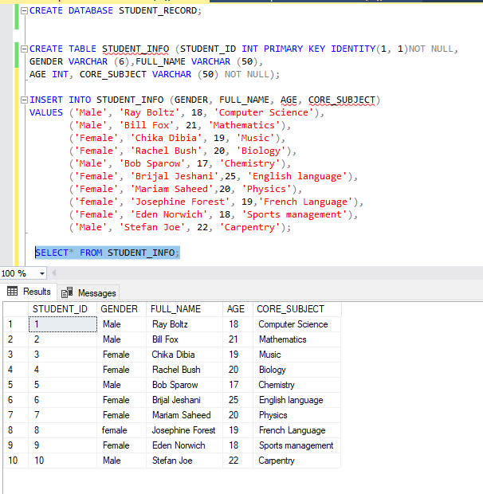
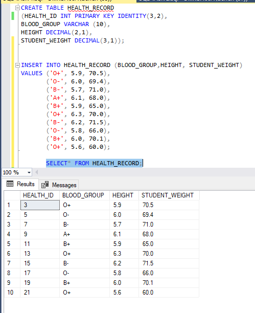
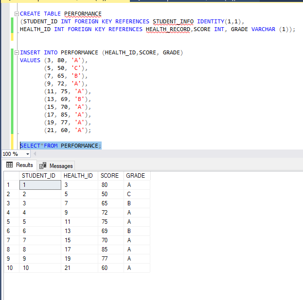
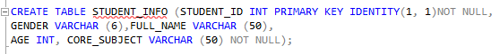
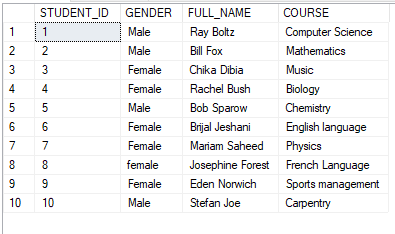
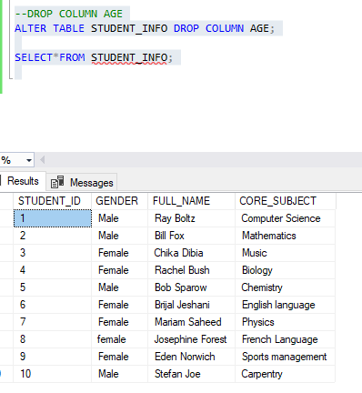

# CREATION-OF-DATA-BASE-AND-TABLES-IN-SQL

# SKILLS APPLIED

Creating Databases

Creating Tables

Inserting values into tables

Adding constraints to columns in a table

Retrieving information using SELECT

Altering table structure

The screenshot below shows the syntax used in creating the database STUDENT_RECORD and the tableS STUDENT_INFO, HEALTH_RECORD, and PERFOMANCE.

# To add a constraint that will prevent the ID and CORE_SUBJECT columns from accepting null values, see syntax below.

# To change column name CORE_SUBJECT to COURSE. In object explorer, right click the table  you intend to rename column and click on design . type the new name and save.

# To drop the AGE column from STUDENT_INFO table, see syntax below.

